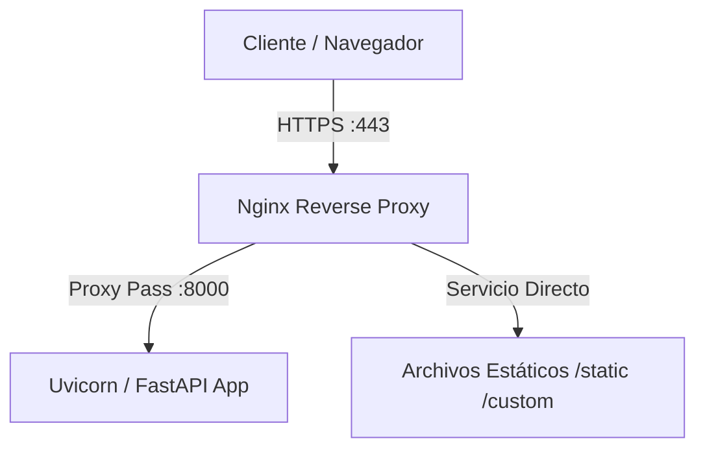

# Despliegue Continuo (CD) y Configuración del Servidor

Este documento detalla la arquitectura de producción, los requisitos de infraestructura, la configuración de servicios y el flujo de despliegue continuo automatizado para el sitio web corporativo de **EITEC**.

---

## 1. Arquitectura de Producción

En producción, la aplicación sigue una arquitectura clásica de tres capas en el servidor (VPS):



### Componentes clave:
1. **Nginx**:
   - Actúa como proxy reverso, terminación de SSL/TLS (Let's Encrypt).
   - Maneja la compresión Gzip para reducir tiempos de transferencia.
   - Sirve directamente el contenido estático de `/static` y `/custom` sin sobrecargar la aplicación Python, optimizando rendimiento y cacheo.
2. **Uvicorn**:
   - Servidor ASGI que ejecuta la aplicación FastAPI (`src.infrastructure.fastapi.app:app`) escuchando en `localhost:8000`.
3. **Systemd**:
   - Administra el ciclo de vida del proceso de Python, asegurando el reinicio automático tras fallas o reinicios del servidor.
4. **Git & SSH Deploy Script**:
   - Automatización basada en SSH sin agentes para actualizar el código en producción con verificación automática y rollback automático en caso de fallos de inicio de la aplicación.

---

## 2. Requisitos Previos del VPS (Debian / Ubuntu)

Antes de iniciar la configuración, asegúrese de que el servidor tenga instalados los siguientes paquetes básicos:

```bash
sudo apt update
sudo apt install -y git python3-pip python3-venv nginx certbot python3-certbot-nginx curl ufw
```

### Configuración del Firewall (UFW)
Asegure el VPS exponiendo únicamente los puertos necesarios:

```bash
sudo ufw default deny incoming
sudo ufw default allow outgoing
sudo ufw allow ssh          # Puerto SSH configurado (ej: 22 o el custom 5932)
sudo ufw allow 'Nginx Full' # Puertos 80 y 443
sudo ufw enable
```

---

## 3. Preparación del Entorno y Usuario Dedicado

**REGLA DE ORO DE DEVOPS:** Nunca ejecutar la aplicación como `root`. Si un atacante logra comprometer la aplicación web, tendría control total del sistema operativo.

Para mitigar esto, usamos un usuario dedicado del sistema (`datamaq`) con permisos mínimos.

### Paso 1: Configuración del usuario y permisos
Ejecute el script de bootstrap [setup-vps-user.sh](file:///home/agustin/proyectos_software/www-eitec/scripts/setup-vps-user.sh) **como root** en el servidor VPS. 
Este script realizará las siguientes acciones:
- Crear el usuario `datamaq`.
- Crear el directorio `/var/www/www-eitec`.
- Configurar permisos en `/etc/sudoers.d/datamaq-deploy` para permitir que el usuario de deploy reinicie el servicio systemd sin ingresar contraseña.

### Paso 2: Clonar el Repositorio e Instalar el Entorno Virtual
Inicie sesión con el usuario de la aplicación en el VPS:

```bash
sudo -u datamaq -i
cd /var/www/www-eitec
git clone <URL_DEL_REPOSITORIO> .
python3 -m venv .venv
./.venv/bin/pip install -r requirements.txt
```

### Paso 3: Configurar Archivo de Entorno (`.env`)
Copie la plantilla de variables de entorno y configure los valores reales para producción (como las credenciales SMTP de producción y las claves de producción de Google reCAPTCHA):

```bash
cp .env.example .env
nano .env
```

---

## 4. Configuración del Servicio Systemd

Cree el archivo de definición del servicio en `/etc/systemd/system/eitec.service` (o el nombre configurado en `DEPLOY_SERVICE_NAME`):

```ini
[Unit]
Description=EITEC Website FastAPI Application
After=network.target

[Service]
User=datamaq
Group=datamaq
WorkingDirectory=/var/www/www-eitec
EnvironmentFile=/var/www/www-eitec/.env
ExecStart=/var/www/www-eitec/.venv/bin/uvicorn src.infrastructure.fastapi.app:app --host 127.0.0.1 --port 8000 --workers 4
Restart=always
RestartSec=5
LimitNOFILE=65535

[Install]
WantedBy=multi-user.target
```

Habilite e inicie el servicio:

```bash
sudo systemctl daemon-reload
sudo systemctl enable eitec.service
sudo systemctl start eitec.service
sudo systemctl status eitec.service
```

---

## 5. Configuración de Nginx

Configure Nginx creando un archivo `/etc/nginx/sites-available/eitec` con el siguiente contenido profesional:

```nginx
server {
    listen 80;
    server_name eitec.coop.ar www.eitec.coop.ar; # Reemplazar con sus dominios reales

    # Redirección global a HTTPS
    location / {
        return 301 https://$host$request_uri;
    }
}

server {
    listen 443 ssl http2;
    server_name eitec.coop.ar www.eitec.coop.ar;

    # SSL Configurado mediante Certbot
    # ssl_certificate ...
    # ssl_certificate_key ...

    # Seguridad de Headers (OWASP Recomendado)
    add_header X-Frame-Options "DENY" always;
    add_header X-Content-Type-Options "nosniff" always;
    add_header X-XSS-Protection "1; mode=block" always;
    add_header Referrer-Policy "no-referrer-when-downgrade" always;
    add_header Content-Security-Policy "default-src 'self' http: https: data: blob: 'unsafe-inline'" always;

    # Compresión Gzip para mejorar carga de assets
    gzip on;
    gzip_types text/plain text/css application/json application/javascript text/xml application/xml application/xml+rss text/javascript;
    gzip_min_length 1000;

    # Servir archivos estáticos directamente desde Nginx (Bypass FastAPI)
    location /static/ {
        alias /var/www/www-eitec/static/;
        expires 30d;
        add_header Cache-Control "public, no-transform";
        access_log off;
    }

    location /custom/ {
        alias /var/www/www-eitec/static/custom/;
        expires 30d;
        add_header Cache-Control "public, no-transform";
        access_log off;
    }

    # Proxy hacia el backend de Uvicorn / FastAPI
    location / {
        proxy_pass http://127.0.0.1:8000;
        proxy_http_version 1.1;
        proxy_set_header Upgrade $http_upgrade;
        proxy_set_header Connection "upgrade";
        proxy_set_header Host $host;
        proxy_set_header X-Real-IP $remote_addr;
        proxy_set_header X-Forwarded-For $proxy_add_x_forwarded_for;
        proxy_set_header X-Forwarded-Proto $scheme;
        
        # Tiempos de espera de proxy
        proxy_connect_timeout 60s;
        proxy_read_timeout 60s;
        proxy_send_timeout 60s;
    }
}
```

Habilite el sitio y verifique la sintaxis antes de reiniciar Nginx:

```bash
sudo ln -s /etc/nginx/sites-available/eitec /etc/nginx/sites-enabled/
sudo nginx -t
sudo systemctl restart nginx
```

### Configuración SSL (Certbot)
Genere los certificados SSL válidos y configure automáticamente Nginx:

```bash
sudo certbot --nginx -d eitec.coop.ar -d www.eitec.coop.ar
```

---

## 6. Proceso de Despliegue Automatizado y Rollback

El script de deploy local [deploy-server.sh](file:///home/agustin/proyectos_software/www-eitec/scripts/deploy-server.sh) está diseñado para ejecutarse remotamente mediante SSH sin requerir agentes adicionales ni herramientas complejas (como Ansible o Docker en este entorno específico).

### Funcionamiento paso a paso:
1. **Conexión SSH Segura**: Se conecta a la IP de producción usando el puerto SSH no estándar definido.
2. **Respaldo previo (Rollback Point)**: Lee el hash del commit actual mediante `git rev-parse HEAD` para saber exactamente a dónde regresar en caso de fallo.
3. **Pull**: Actualiza el código de la rama activa (`git pull`).
4. **Instalación**: Actualiza las dependencias de Python del `.venv` si hubiera nuevas en `requirements.txt`.
5. **Reinicio**: Reinicia el servicio systemd (`sudo systemctl restart eitec.service`).
6. **Health Check Proactivo**: Realiza peticiones de salud HTTP a `http://localhost:8000/` durante un máximo de 30 segundos.
7. **Verificación / Rollback**: 
   - Si la aplicación responde con un estado `HTTP 200` en los primeros 30 segundos, el deploy se da por exitoso.
   - Si la aplicación falla (error 500, crash de inicio, timeout), el script ejecuta automáticamente un **Rollback**: hace un `git reset --hard <PREVIOUS_COMMIT>` y reinicia el servicio systemd con la versión estable anterior.

### Ejecución local del deploy:
```bash
./scripts/deploy-server.sh
```

### Visualización de logs del servidor en tiempo real:
```bash
./scripts/view_logs.sh
```
